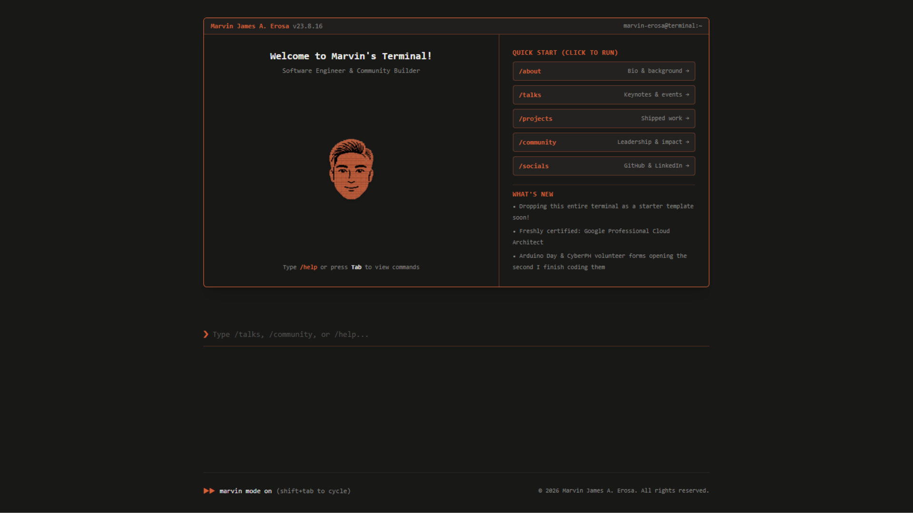

# Terminal Portfolio Template

An interactive terminal-inspired portfolio template, built with **Next.js (App Router)**, **TypeScript**, **Tailwind CSS**, **JetBrains Mono**, and **Lucide Icons**.



---

## 📄 License

Licensed under the [MIT License](./LICENSE). Free to use, modify, and share.

---

## ✨ Features

- **Amber TUI Aesthetic**: Deep matte charcoal canvas (`#181817`), warm amber/terracotta accents (`#D46238`), open-source `JetBrains Mono` typography, and a custom **Retro Pixel CRT Terminal Icon** (`TerminalMascot` inline SVG + `/public/logo.svg`).
- **Real-Time Command Palette & Autocomplete**:
  - Type `/` or any partial command (e.g. `tal` or `/pro`) to filter commands with highlighted character matches.
  - Press **Tab** to fill or **Enter** to automatically execute the top matching command.
  - Use **ArrowUp / ArrowDown** to cycle through suggestions or command history.
- **Point-and-Click Quick Start Chips**: Visitors who prefer clicking over typing can launch `/about`, `/talks`, `/projects`, `/community`, or `/socials` directly from the welcome banner.
- **Smooth Scroll-to-Section**: Executing any command smoothly scrolls the viewport so the command header (`❯ /command`) lands cleanly at the top of the screen.
- **Full-Screen Image Lightbox**: Click any talk slide, project screenshot, community photo, or portrait to inspect it in a high-resolution modal (`Esc` or backdrop click to close).
- **Zero PII / Ready-to-Customize**: Comes pre-populated with clean placeholder data (`Alex Rivera`) and offline SVG assets in `/public` so it works immediately out of the box.

---

## 🚀 Quick Start

1. **Navigate into the template directory:**

   ```bash
   cd terminal-portfolio-template
   ```

2. **Install dependencies:**

   ```bash
   npm install
   ```

3. **Start the development server:**

   ```bash
   npm run dev
   ```

   Open [http://localhost:3000](http://localhost:3000) in your browser.

4. **Build for production:**
   ```bash
   npm run build
   npm start
   ```

---

## 🛠️ Customization Guide

All portfolio content is centralized so you can personalize the entire site in a few minutes:

| What to Customize                                    | File Path                                                                                          |
| :--------------------------------------------------- | :------------------------------------------------------------------------------------------------- |
| **Talks, Projects, Community, Socials & Commands**   | [`components/terminal/data.ts`](./components/terminal/data.ts)                                     |
| **Welcome Banner (Name, Tagline, Icon, What's New)** | [`components/terminal/welcome-banner.tsx`](./components/terminal/welcome-banner.tsx)               |
| **About Me Bio, Role, Education & Portrait**         | [`components/terminal/commands/about-view.tsx`](./components/terminal/commands/about-view.tsx)     |
| **Contact Email & Links**                            | [`components/terminal/commands/contact-view.tsx`](./components/terminal/commands/contact-view.tsx) |
| **Page Title, Meta Description & Favicon**           | [`app/layout.tsx`](./app/layout.tsx)                                                               |
| **Static Images & SVG Assets**                       | [`public/`](./public/) (`portrait.svg`, `talk-*.svg`, `project-*.svg`, `community-*.svg`)          |

---

## ⌨️ Supported Terminal Commands

| Command      | Description                                                  |
| :----------- | :----------------------------------------------------------- |
| `/about`     | Professional background, engineering philosophy & portrait   |
| `/talks`     | Keynotes, conference sessions & technical presentations      |
| `/projects`  | Side projects, open-source tooling & shipped systems         |
| `/community` | Community leadership, mentorship & open-source initiatives   |
| `/socials`   | GitHub, LinkedIn, X & direct email links                     |
| `/contact`   | Direct reach out and collaboration channels                  |
| `/help`      | List all supported terminal commands                         |
| `/clear`     | Wipe previous terminal output and reset session (`Ctrl + L`) |

---

## 📁 Directory Structure

```text
terminal-portfolio-template/
├── app/
│   ├── globals.css                  # Custom dark scrollbar & theme variables
│   ├── layout.tsx                   # Root HTML layout, JetBrains Mono font & metadata
│   └── page.tsx                     # Main entry page rendering <TerminalShell />
├── components/
│   ├── theme-provider.tsx           # Dark mode provider
│   └── terminal/
│       ├── terminal-shell.tsx       # Interactive CLI controller, autocomplete & scroll
│       ├── command-suggestions.tsx  # Floating slash-command autocomplete palette
│       ├── data.ts                  # Central data store (TALKS, PROJECTS, COMMUNITY, SOCIALS)
│       ├── image-lightbox.tsx       # Full-screen modal image viewer
│       ├── types.ts                 # TypeScript interfaces
│       ├── welcome-banner.tsx       # Hero box with Retro Pixel CRT Icon & quick links
│       └── commands/                # Individual command output views
│           ├── about-view.tsx
│           ├── community-view.tsx
│           ├── contact-view.tsx
│           ├── help-view.tsx
│           ├── projects-view.tsx
│           ├── socials-view.tsx
│           └── talks-view.tsx
├── lib/
│   └── utils.ts                     # Tailwind class merging helper
└── public/                          # Pixel CRT terminal favicon (logo.svg) & placeholder assets
```
